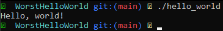

<h1 align="center">✨ Worst Hello World ✨</h1>

<h6 align="center"><em>Like, literally the worst hello world you've ever seen Scoob!</em></h6>

# Yes, it works!
###### _Only on x86_64 architecture..._


## Compiled Release

| Release | Binary |
|:-------:|:------:|
| 1.0     | [hello_world](https://github.com/Arty3/Worst-Hello-World/releases/download/v1.0/hello_world) |

## How to
### Clone:
```sh
git clone https://github.com/Arty3/Worst-Hello-World.git
cd Worst-Hello-World
```

### Compile:

###### Hint: Make sure you have `make` and `clang` installed
```sh
$(which make) all clean
```

### Run:
```sh
./hello_world
```

### Clean:
```sh
$(which make) fclean
```
